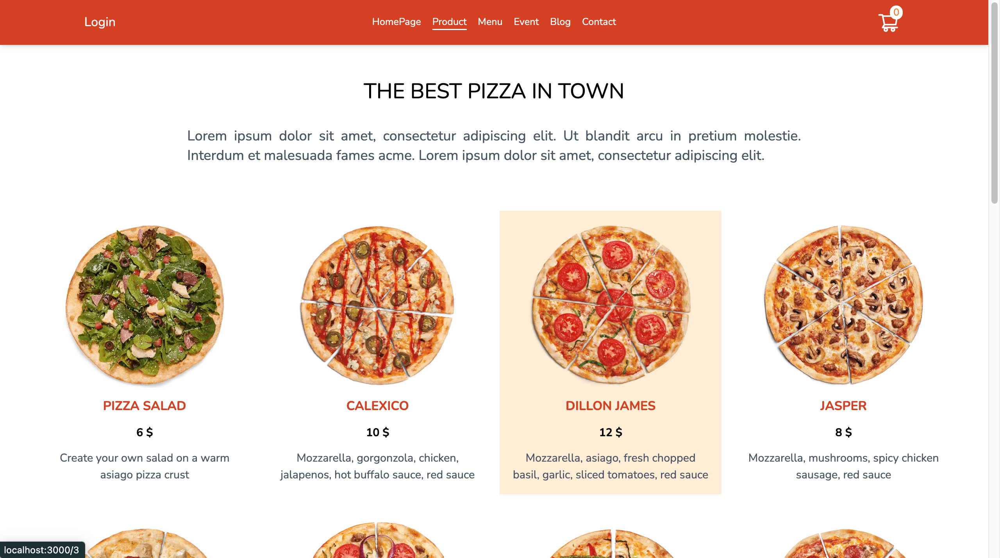
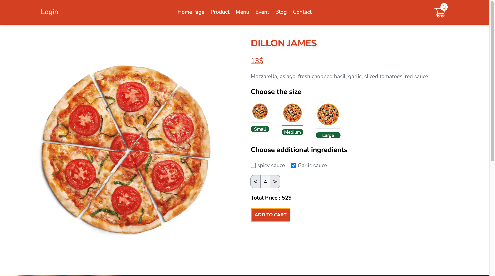
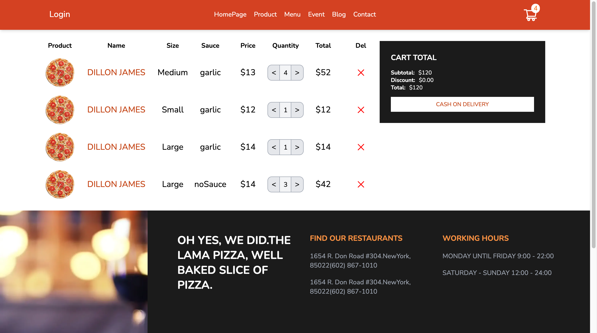

# Pizza Shop Application using Next.JS 
This Repo Contains a Pizza Shopping WebSite Made Using NextJs , Context And Redux.

## Preview
[https://pizza-shop-bay.vercel.app](https://pizza-shop-bay.vercel.app/)

## TechStack
- Reactjs
- NextJs
- Context
- Redux
- react-Icons

## Features
- Pizza Shopping Application
- Full Responsive 
- Add Product To Cart
- Using Context On Context Branches
- Using Redux On Redux Branches
- Edit Cart Item
- Delete Cart Item

## How To Run Context Example
1. Sellect Context Branches Repo
1. Clone Repo
1. Run `"npm install"` Command
1. Run `"npm run dev"` Command

## How To Run Redux Example
1. Sellect Redux Branches Repo
1. Clone Repo
1. Run `"npm install"` Command
1. Run `"npm run dev"` Command
2. 
## ScreenShot
- Show Pizza List

  

- Select Product attribute 

  
- Show Selected Product On Cart

